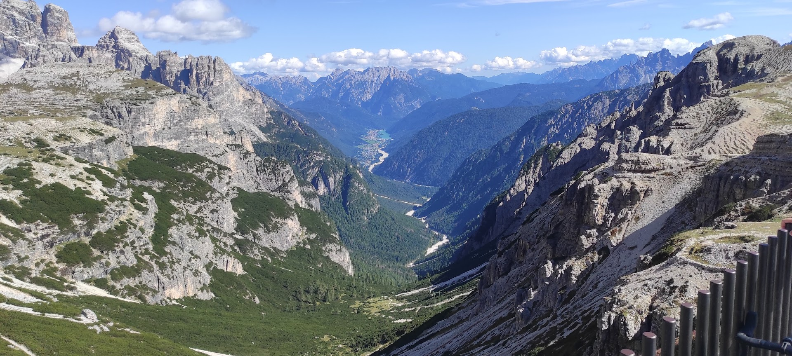

# MSF (Modified Single Flow) Debris Flow Hazard Assessment Tool



**MSF (Modified Single Flow)** is a regional-scale GIS-based tool designed for the assessment of debris-flow runout zones and susceptibility. By leveraging Digital Elevation Models (DEMs) and initiation points, the software simulates the lateral spreading and deposition of mass movements with high computational efficiency.

---

## 🇪🇺 Funding & Acknowledgements
This software has been developed as part of the research activities within the project:
**PRIN 2022: PROGETTI DI RICERCA DI RILEVANTE INTERESSE NAZIONALE – Bando 2022**

*   **Project Title**: MORPHEUS - GeoMORPHomEtry throUgh Scales for a resilient landscape
*   **Protocol**: 2022JEFZRM
*   **Financed by**: European Union - NextGenerationEU, Ministero dell'Università e della Ricerca (MUR), and Italia Domani (PNRR)

We acknowledge the financial support provided by the Italian Ministry of University and Research and the European Union under the NextGenerationEU framework and the Italia Domani (Piano Nazionale di Ripresa e Resilienza) initiative.

---

## 📚 Scientific Reference
The underlying algorithm is based on the Modified Single Flow model developed and popularized by:
1.  **Huggel, C., Kääb, A., Haeberli, W., & Krummenacher, B. (2003).** *"Regional-scale GIS-models for assessment of hazards from glacier lake outburst floods: combined determination of flood propagation and avalanche runout."* Natural Hazards and Earth System Sciences.
2.  **Gruber, S., Huggel, C., & Pike, R. J. (2009).** *"Modelling mass movements."* In Geomorphometry: Concepts, Software, Applications.

---

## 🚀 Key Features
*   **Regional Batch Processing:** Handle thousands of initiation points efficiently using multiprocessing.
*   **Flexible Inputs:** Supports both Shapefiles (point/polygon) and Raster data for initiation zones.
*   **Automated Pre-processing:** Integrated pit-filling and flow direction calculation via direct WhiteboxTools integration.
*   **Resampling Engine:** Built-in DTM resampling with median/mean/bilinear aggregation methods.
*   **Dual Interface:** Full Graphical User Interface (PyQt5) for interactive use and a Command Line Interface (CLI) for headless/automated workflows.
*   **Standalone Executable:** Fully portable version available in Releases (no Python installation required).

---

## 🛠 Usage & Detailed Guide

### Graphical User Interface (GUI)
Simply run the standalone executable or run from source:
```bash
python main.py
```

#### 1. Inputs Tab
*   **Base DTM**: The elevation model (GeoTIFF) used for all topographic calculations.
*   **Initiation Points**: 
    *   **Shapefile**: Points or Polygons. The software extracts pixel locations from these geometries.
    *   **Raster**: Binary or weighted raster where cells > 0 are treated as sources.
*   **Optional Overrides**: Toggle "Use External" to provide your own pre-filled DTMs or D8 Flow Directions. If toggled, the engine will skip its internal calculation steps for these files.
*   **PQ_LIM Filename**: Custom name for the final hazardous zone output.

#### 2. Processing Tab
*   **Pit Filling**: Hydrologically corrects the DTM. Using **WhiteboxTools (Wang & Liu)** is highly recommended for accuracy.
*   **Flow Direction**: Calculates the steepest path.

#### 3. MSF Model Parameters
*   **H/L Threshold**: Defines the runout stopping condition ($L$ is distance, $H$ is vertical drop). `0.19` is a common default for regional assessments.
*   **Max Slope**: Threshold for flow initiation.
*   **Direction Aware Uphill**: Adds physical consistency by preventing flow paths from reversing direction sharply.
*   **Direct Distance H/L**: Toggle between Euclidean (straight line) vs. Along-Path distance for the $H/L$ calculation.

#### 4. Resampling & Parallel
*   **Resampling**: Convert high-res DTMs (e.g., 1m) to regional scales (e.g., 5m or 10m) to drastically reduce processing time.
*   **Parallel Processing**: Assign multiple CPU cores. For regional maps with >1000 sources, using 8-16 workers provides significant speedups.

---

## 🚀 Command Line Interface (CLI)
For automated tasks or server-side execution:
```bash
# Run with a saved configuration
MSF_Regional_Unified.exe --config my_settings.json

# Dump a template to edit
MSF_Regional_Unified.exe --dump-config template.json
```

---

## ⚙️ Requirements (for Source)
If running from source, you need Python 3.10+ and the following libraries:
*   `rasterio`
*   `numpy`
*   `geopandas`
*   `PyQt5` (for GUI)
*   `whitebox` (Python wrapper for pre-compiled binary)

---

## 📦 Compilation
To build your own standalone executable:
1.  Place the `whitebox_tools.exe` binary in the `WBT/` folder.
2.  Run PyInstaller:
```bash
pyinstaller --clean msf_standalone.spec
```

---

## 📝 License & Disclaimer
This project is licensed under the **GNU General Public License v2.0** - see the [LICENSE](LICENSE) file for details.

### ⚠ IMPORTANT: AT YOUR OWN RISK
*   **No Warranty**: This software is provided "as is" without warranty of any kind, either expressed or implied.
*   **User Responsibility**: The entire risk as to the quality and performance of the program is with you. 
*   **Liability**: In no event shall the authors or copyright holders be liable for any claim, damages, or other liability, whether in an action of contract, tort, or otherwise, arising from, out of, or in connection with the software or the use or other dealings in the software.
*   **Scientific Results**: The developers assume no responsibility for the accuracy, reliability, or completeness of any results obtained through the use of this software. It is a research tool and should be used with professional judgment.

---

## 📬 Contact & Support
Developed for regional-scale hazard analysis. For bugs and feature requests, please open an Issue on this GitHub repository.
